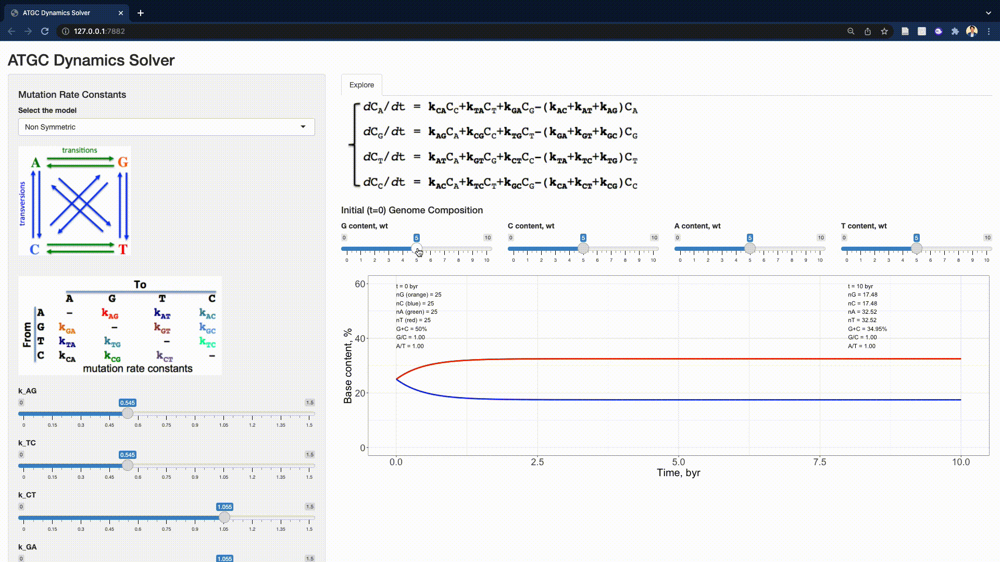

# Genomic PR-2 Simulations Shiny

## Interactive web application for the simulation-based explanation for the Chargaff's second parity rule phenomenon.

Numerical simulation models that express the individual base contents through the underlying mutation rate constants to produce the time evolution of genomic base content within 4.28-byr period.

## Installation and Usage

Download the source code from the [GitHub](https://github.com/SahakyanLab/GenomicPR2SimulationsShiny) repository. You can also do that *via* a Linux/Unix/OSX command line, given that git is installed, by typing the following:

```
git clone https://github.com/SahakyanLab/GenomicPR2SimulationsShiny
```

Once installed, open the `exe` executable file in the local folder.

## Requirements

* [shiny](https://cran.r-project.org/web/packages/shiny/index.html) >= 1.7.1
* [deSolve](https://cran.r-project.org/web/packages/deSolve/index.html) >= 1.30
* [dplyr](https://cran.r-project.org/web/packages/dplyr/index.html) >= 1.0.7
* [ggplot2](https://cran.r-project.org/web/packages/ggplot2/index.html) >= 3.3.5

## Example

Example demonstration of varying parameters with results plotted in the main panel.



## R&D pipeline

Please visit the [GenomicPR2Simulations GitHub](https://github.com/SahakyanLab/GenomicPR2Simulations) repository for the R&P pipeline for the simulation-based explanation for the Chargaff's second parity rule phenomenon.